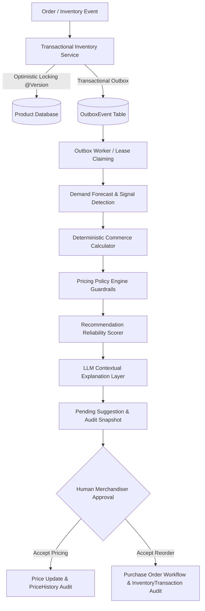

# StockPulse — AI Inventory & Dynamic Pricing Platform

> **Production-Inspired Enterprise Architecture Prototype**  
> A reactive commerce advisor that automatically detects inventory threshold drops and demand velocity spikes, uses a deterministic optimization engine and business guardrails to calculate prices and reorder quantities, leverages LLMs for contextual explanations, and surfaces complete audit trails to merchandising.

---

## 📐 System Architecture Diagram



---

## 🚀 Quickstart (Under 5 Minutes)

### Prerequisites
- **Java 17+**
- **Node.js 18+** & `npm`

---

### 1. Start Backend (`http://localhost:8080`)

```bash
cd backend
# Optional: export LLM_API_KEY=your-key (works fully offline with deterministic rules by default)
mvnw spring-boot:run
```

*The backend starts on `http://localhost:8080` with pre-seeded products in H2 in-memory database (`/h2-console`). Flyway database migrations run automatically on startup.*

---

### 2. Start Frontend (`http://localhost:5173`)

In a separate terminal:

```bash
cd frontend
npm install
npm run dev
```

Open `http://localhost:5173` in your browser.

---

## 💡 Architectural Highlights & Key Upgrades

### 🔄 Design Evolution (V1 vs V2)

| Dimension | Version 1 (Hackathon Baseline) | Version 2 (Production-Inspired Engine) |
| :--- | :--- | :--- |
| **Numerical Source** | LLM invented pricing & reorder numbers | **Deterministic formulas & forecast calculators** compute exact numbers |
| **Business Guardrails** | Simple max 5x current price check | **`PricingPolicyEngine`**: Margin floors (15%), Category caps (+15%/+20%), 24h Cooldowns |
| **Confidence Scoring** | Uncalibrated LLM number | **Mathematical `ReliabilityScore`** based on data completeness & signal strength |
| **Event Reliability** | In-memory Spring events (lost on crash) | **Transactional Outbox Pattern** (`OutboxEvent` table + worker leasing) |
| **Concurrency** | Unprotected stock updates | **JPA `@Version` Optimistic Locking** (prevents overselling) |
| **Reorder Fulfillment** | Instant physical stock inflation | **`PurchaseOrder` workflow** (`incomingStock` $\rightarrow$ goods receipt) |
| **Auditability** | None | Full audit trails for `PriceHistory`, `InventoryTransaction`, and `RecommendationAudit` |

---

## 🛠️ Failure Modes & Resilience Matrix

| Failure Mode | System Behavior & Mitigation |
| :--- | :--- |
| **LLM Gateway Timeout / Unavailability** | Instantly falls back to deterministic rule reasoning (`AICommerceAdvisor` fallback pipeline). |
| **Worker Instance Crash** | Outbox worker lease expires after 30 seconds; another instance automatically claims the pending event. |
| **Concurrent Customer Orders** | Optimistic locking (`@Version`) throws `OptimisticLockingFailureException` and rolls back overcommitted stock. |
| **Duplicate Trigger Events** | Database-level unique indexes on `(product_id, trigger_reason, status)` prevent duplicate `PENDING` suggestions. |
| **Invalid Proposed Price** | `PricingPolicyEngine` clamps price within margin floors and category caps. |

---

## ⚠️ Known Limitations & Production Roadmap

- **Storage Engine**: Configured for development using **H2 in-memory DB**. For production deployments, activate the PostgreSQL profile (`spring.profiles.active=prod`).
- **Distributed Worker Locking**: Current outbox event leasing uses database timestamps (`lockedBy`, `leaseExpiry`). High-throughput clusters should migrate to Redis (`ShedLock`) or Kafka/RabbitMQ.
- **Authentication & RBAC**: Currently operates in single-tenant merchandising mode. Role-based access control (`ADMIN`, `MERCHANDISER`, `VIEWER`) is planned for Sprint 2 enterprise integration.
- **Observability**: Metrics collection via Micrometer / Prometheus / Grafana is recommended for tracking queue latency and LLM fallback rates.

---

## 📡 API Endpoint Summary

| Method | Endpoint | Description |
| :--- | :--- | :--- |
| `GET` | `/api/products` | Retrieve catalog with status and category filters |
| `POST` | `/api/products` | Create a new product dynamically |
| `PATCH` | `/api/products/{id}/stock` | Update stock level (logs transaction & fires outbox trigger) |
| `POST` | `/api/products/{id}/orders` | Simulate an order sale (decrements stock & bumps velocity) |
| `POST` | `/api/products/{id}/suggest-pricing` | On-demand pricing recommendation |
| `POST` | `/api/products/{id}/suggest-reorder` | On-demand reorder recommendation |
| `GET` | `/api/suggestions/pending` | Fetch all pending suggestions |
| `PATCH` | `/api/suggestions/pricing/{id}/accept` | Approve pricing (updates price & logs `PriceHistory`) |
| `PATCH` | `/api/suggestions/reorder/{id}/accept` | Approve reorder (creates `PurchaseOrder` & updates `incomingStock`) |
| `GET` | `/api/purchase-orders` | List purchase orders |
| `PATCH` | `/api/purchase-orders/{id}/receive` | Receive shipment (increments physical stock & logs `InventoryTransaction`) |
| `GET` | `/api/audit/price-history` | Fetch price change history logs |
| `GET` | `/api/audit/inventory-transactions` | Fetch inventory transaction logs |
| `GET` | `/api/audit/recommendations` | Fetch recommendation decision audits |

---

## 📄 Architecture Decision Record (ADR)
See [ADR.md](./ADR.md) for detailed engineering decisions on deterministic calculation, policy guardrails, purchase order workflows, outbox events, and auditability.
